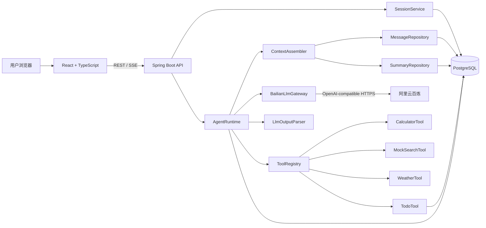

# Architecture — Minimal Agent

## 总体架构

## 模块边界

| 模块 | 职责 | 不负责 |
|------|------|--------|
| `api` | HTTP DTO、Controller、异常响应 | 业务逻辑、LLM 调用 |
| `agent` | Loop、运行状态、终止原因、输出解析 | 工具实现、持久化 |
| `llm` | 百炼协议 DTO、HTTP client、重试策略 | Agent 决策、工具 |
| `tool` | 工具接口、注册表、参数校验和实现 | API、LLM |
| `memory` | Context 选择、token 估算、摘要压缩 | 消息持久化 (委托给 session) |
| `session` | Session 所有权、消息持久化和列表 | Agent 逻辑 |
| `trace` | 通过 API 控制器实时展示 | 持久化实体 |
| `todo` | 待办领域对象和数据库访问 | 业务规则 |

## 数据流

1. 用户发送消息 → `AgentController`
2. Controller 创建 `AgentRunCommand` → `AgentRuntime.run()`
3. Runtime 检查 Session 所有权 + 获取锁
4. 保存用户消息 → 构建 Context (System Prompt + Summary + 最近消息)
5. Loop:
   - `BailianLlmGateway.chat()` → 百炼 API
   - `LlmOutputParser.parse()` → `AgentDecision`
   - FinalAnswer → 保存回复 → 返回
   - ToolCalls → `ToolExecutor.execute()` → observation → 回到 Loop
   - Invalid → 修复一次 → 回到 Loop
6. 释放锁 → 返回 `AgentRunResult`
7. Controller 返回 JSON 或 SSE 事件

## 安全边界

- API Key 仅存在于环境变量，不写入代码、配置、日志或 Git
- `userId`/`sessionId` 由服务端 `ToolContext` 注入，LLM 不可控
- 工具结果截断至 32KB，防止上下文爆炸
- 外部错误不泄露堆栈，使用 `requestId` 关联日志
- 日志禁止记录 Authorization header、API Key、System Prompt、原始推理
